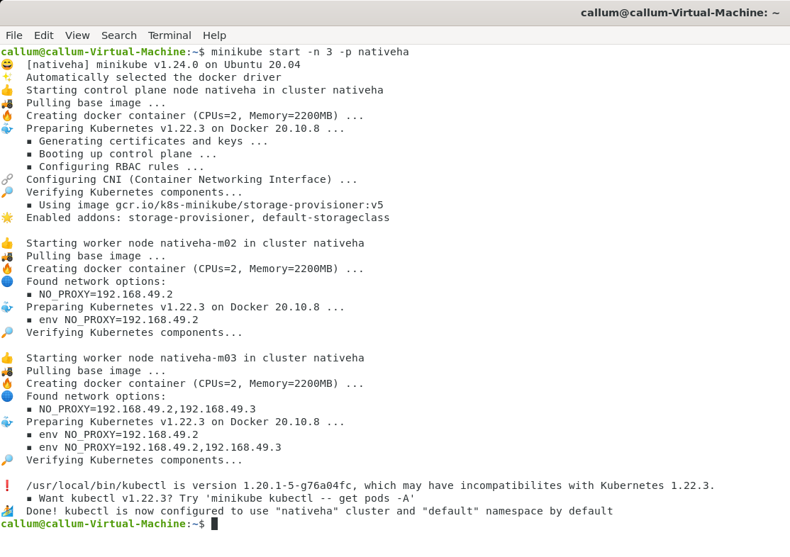

# Deploying the IBM MQ Native HA using the Helm Chart on minikube
This sample demonstrates how to deploy IBM MQ Native HA on a single machine using [minikube](https://minikube.sigs.k8s.io/).

## Pre-reqs
Prior to using the Helm chart you will need to install three dependencies:
1. [Helm version 3](https://helm.sh/docs/intro/install/)
2. [Kubectl](https://kubernetes.io/docs/tasks/tools/)
3. [minikube](https://minikube.sigs.k8s.io/docs/start/) - you require 2 cores to run minikube

## Installation
1. Minikube can be started where it simulates a number of worker nodes. With IBM MQ Native HA three worker nodes are required. Start minikube with these 3 worker nodes by running the following command:      
  ```
  minikube start -n 3 -p nativeha
  ```
  
1. This will automatically configure kubectl for minikube. We are now ready to deploy IBM MQ Native HA. Change directories to *deploy*: `cd deploy`      
1. Run the installation command to deploy an instance of the helm chart: `./install.sh <namespace>`            
    Where \<namespace\> is the Kubernetes namespace where the resources should be deployed into. With minikube this is normally `default`. This will deploy a number of resources:
    * The IBM MQ Helm Chart using the properties within the [secureapp_nativeha.yaml](deploy/secureapp_nativeha.yaml) file.
    * A configMap with MQ configuration to define a default Queue, and the security required.
    * A secret that includes certificates and keys from the `genericresources/createcerts` directory. Assuring the communication in MQ is secure.
1. This will take a minute or so to deploy, and the status can be checked with the following command: `oc get pods | grep secureapp`. Wait until one of the three Pods is showing `1/1` under the ready status (only one will ever show this, the remainding two will be `0/1` showing they are replicas).

## Testing
Within minikube there is an unfortunate behavior on certain platforms where it is not immediately possible to communicate from the host machine to a node port. The issue was reported in this [GitHub issue](https://github.com/kubernetes/minikube/issues/7344). Therefore there are two sets of instructions, one for Linux and another for alternative platforms.

### Testing on Linux
Navigate to *../test* directory. No modifications should be required, as the endpoint configuration for your environment will be discovered automatically.

1. To initiate the testing, run the **./sendMessage.sh \<namespace\>** command. It will then connect to MQ and start sending messages immediately.

1. Open another terminal window and run the **./getMessage.sh \<namespace\>** command. You should see all of the messages being sent by the sendMessaging command.

1. To see how the pods work together in action, run the **oc get pod | grep secureapp** command on another terminal windows to view the current pods, and then delete the running pod (the one with the ready state of `1/1`) by running the command: **oc delete pod secureapphelm-ibm-mq-0** (where the pod name is customized based on which one is active). Once the active pod is deleted, the application connections will then reconnect to the other pod.

1. You can clean up the resources by navigating to the *../deploy* directory and running the command **./cleanup.sh \<namespace\>**. This will delete everything. Do not worry if you receive messages about PVCs not being found, this is a generic clean-up script and assumes a worst case scenario.

1. To remove the minikube environment run:
   ```
   minikube stop -p nativeha
   minikube delete -p nativeha
   ```

### Testing on Mac or Windows
1. Navigate to *../test* directory.

1. To expose the Native HA node port to the host machine run the following command:     
   ```
   minikube service secureapphelm-ibm-mq -p nativeha --url=false
   ```     
   This will return a *node port* to *host machine port* mapping similar to the below:  
   ```
   |-----------|----------------------|-------------|------------------------|
   | NAMESPACE |     NAME             | TARGET PORT |          URL           |
   |-----------|----------------------|-------------|------------------------|
   | default   | secureapphelm-ibm-mq |             | http://127.0.0.1:53581 |
   |           |                      |             | http://127.0.0.1:53582 |
   |-----------|----------------------|-------------|------------------------|
   ```
   Ignore the http prefix and decode the *second entry* into the IP address and port. For instance ```http://127.0.0.1:53582``` equates to the following:
      * IP Address: 127.0.0.1
      * Port: 53582       
   These values will then be used in the following steps.          


3. Open another terminal window and run the ```./sendMessageMinikubeService.sh <ipaddress> <port>``` command, in the above case this would be ```./sendMessageMinikubeService.sh 127.0.0.1 53582```. You should see all of the messages being sent by the sendMessaging command.
1. Open another terminal window and run the ```./getMessageMinikubeService.sh <ipaddress> <port>``` command, in the above case this would be ```./getMessageMinikubeService.sh 127.0.0.1 53582```. You should see all of the messages being sent by the sendMessaging command.
1. To see how the pods work together in action, run the **kubectl get pod | grep secureapp** command on another terminal windows to view the current pods, and then delete the running pod (the one with the ready state of `1/1`) by running the command: **kubectl delete pod secureapphelm-ibm-mq-0** (where the pod name is customized based on which one is active). Once the active pod is deleted, the application connections will then reconnect to the other pod.

1. You can clean up the resources by navigating to the *../deploy* directory and running the command **./cleanup.sh \<namespace\>**. This will delete everything. Do not worry if you receive messages about PVCs not being found, this is a generic clean-up script and assumes a worst case scenario.

1. To remove the minikube environment run:
   ```
   minikube stop -p nativeha
   minikube delete -p nativeha
   ```
